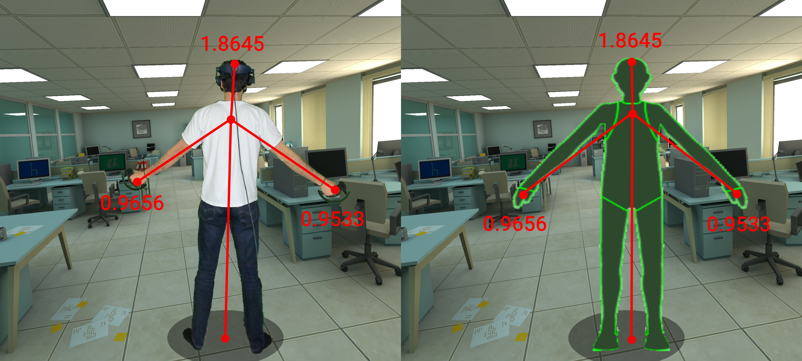
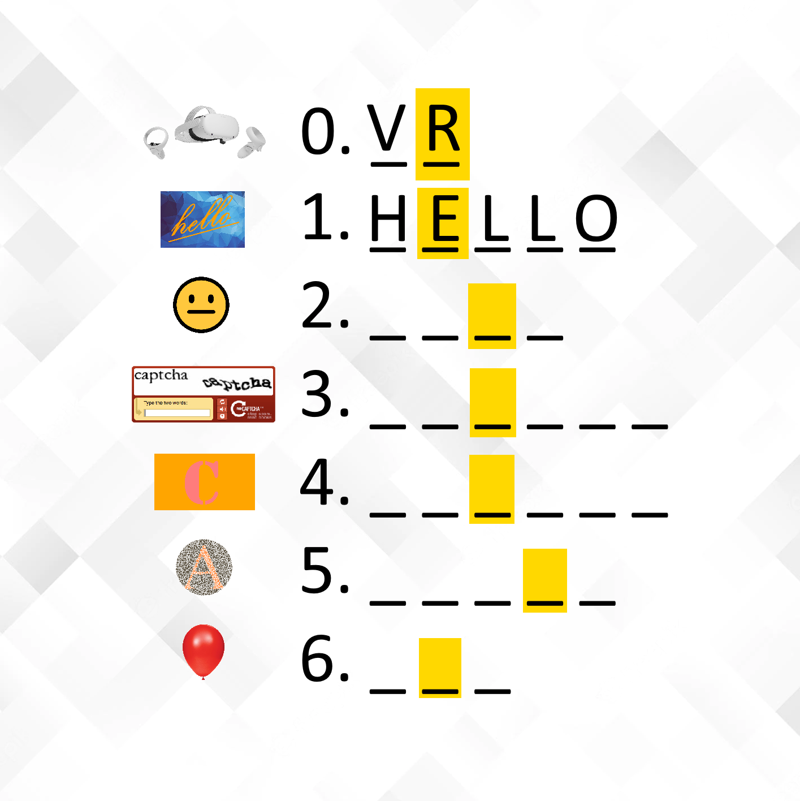

# MetaData
Exploring unprecedented avenues for data harvesting in the metaverse

Height and wingspan inference from VR model geometries

Escape room game element tests short-term memory

Balloon popping game tests proximity and reaction time
