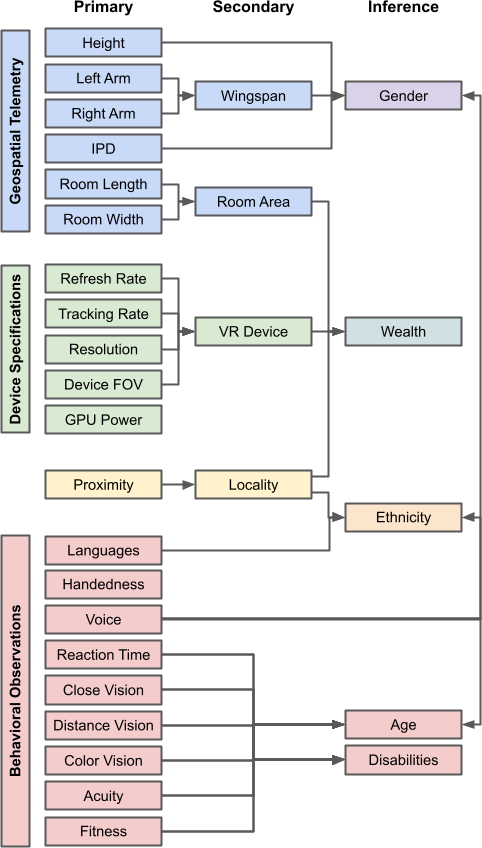
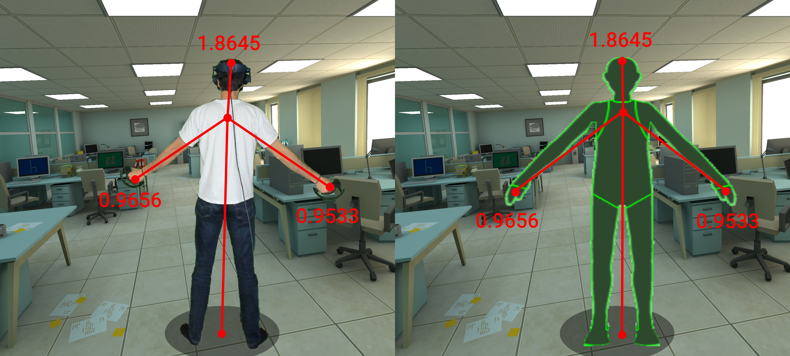
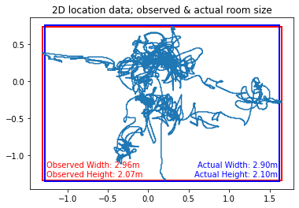
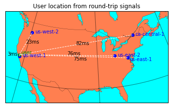
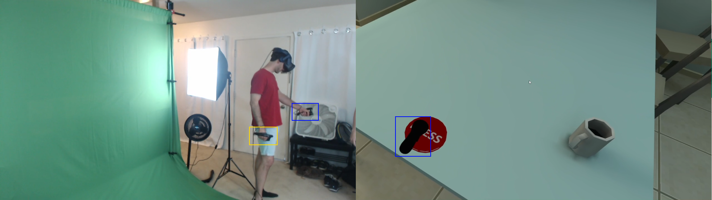
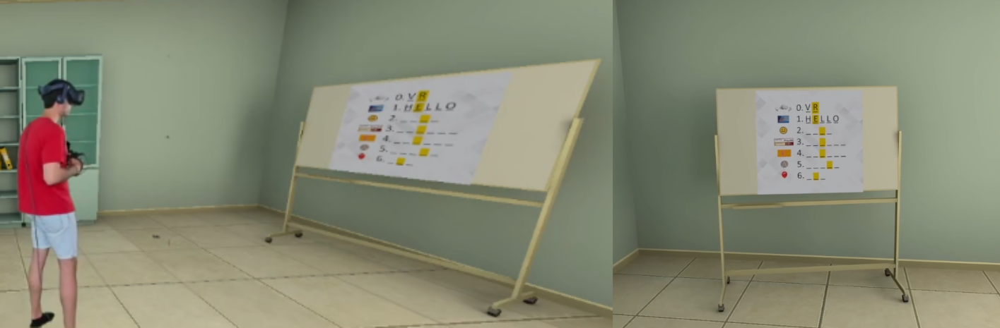

# MetaData
Exploring unprecedented avenues for data harvesting in the metaverse

## Data Sources
 

### Geospatial Telemetry
#### Biometric Measurements
 
Identifying height and wingspan from tracking telemetry

#### Environmental Measurements
 
Identifying room dimensions from tracking telemetry

### Device Specifications
 
Identifying device refresh rate from tracking data

### Location
 
Identifying user location from server proximity

### Behavioral Observations
#### Languages
 
Identifying languages spoken by tracking visual attention

#### Handedness
 
Identifying handedness by observing user interactions

#### Reaction Time
 
Identifying reaction time by observing user interactions

#### Vision
 
Identifying visual acuity by tracking user perception

#### Acuity
 
Assessing memory by measuring user performance
