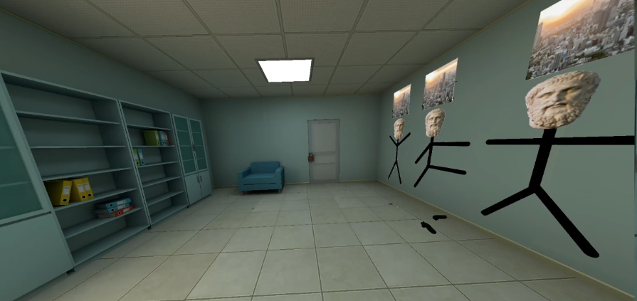
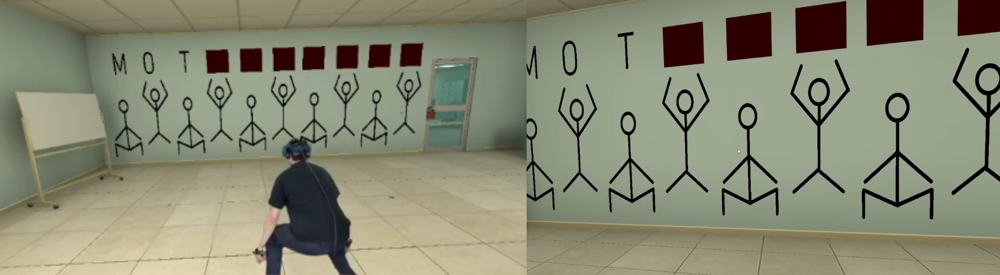

# MetaData
MetaData: Exploring unprecedented avenues for data harvesting in emerging AR/VR environments

[Game](https://github.com/VCNinc/MetaData/releases) |
[Scripts](https://github.com/VCNinc/MetaData/tree/main/Scripts) |
[Sample Data](https://github.com/VCNinc/MetaData/tree/main/Data) |
[Sample Results](https://github.com/VCNinc/MetaData/tree/main/Figures) |
[Developer](https://github.com/VCNinc) |
[Co-Developer](https://github.com/gonzalo-munillag)

This repository contains a virtual reality "escape room" game written in C# using the Unity game engine. It is the chief data collection tool for a research study called "MetaData," which aims to shed light on the unique privacy risks of virtual telepresence ("metaverse") applications. While the game appears innocuous, it attempts to covertly harvest 25+ private data attributes about its player from a variety of sources within just a few minutes of gameplay.

__Contents__
- [Getting Started](#getting-started)
- [Game Overview](#game-overview)
- [Data Collection Tools](#data-collection-tools)
- [Data Analysis Overview](#data-analysis-overview)
- [Data Analysis Scripts](#data-analysis-scripts)
- [Sample Data & Results](#sample-data--results)

## Getting Started
### Building/Installation
The entire repository (outermost folder) is a Unity project folder built for editor version 2021.3.1f1. It can be opened in Unity and built for a target platform of your choice. We have also provided a [pre-built executable](https://github.com/VCNinc/MetaData/releases) for SteamVR on Windows (64-bit), which has been verified to work on the HTC Vive, HTC Vive Pro 2, and Oculus Quest 2 using Oculus Link. If you decide to build the project yourself, make sure you add a "Data" folder to the output directory where the game can store collected telemetry.

### Running & Data Collection
Run `Metadata.exe` to launch the game. Approximately once every second, the game will output a .txt file containing the relevant observations from the last second of gameplay. At the end of the experiment, these files can be concatenated into a single data file to be used for later analysis: `cat *.txt > data.txt`.

### Controls
The following keyboard controls are available (intended for use by the researcher conducting the experiment):

`space`: teleport to next room 
`b`: teleport to previous room 
`r`: reset all rooms 
`p`: pop balloon (room #6) 
`u`: reveal letter (room #8) 
`m`: reveal letter (room #9) 
`c`: play sentence 1 (room #20) 
`v`: play sentence 2 (room #20) 

Many of these controls will make more sense in the context of the game overview. The data logging template included below under [data collection tools](#data-collection-tools) also includes these controls in the relevant locations.

## Game Overview
 
The above figure shows an overview of the escape room building and several of the rooms contained within it. Players move from room to room within the building, completing one or more puzzles to find a "password" before moving to the next room. Further details about each of the rooms are included below.

<table>
  <tr>
    <td>
      <b>Room 1: Hello</b>
      
      <i>Code: Hello</i>
    </td>
    <td>
      <b>Room 2: Face</b>
      
      <i>Code: Face</i>
    </td>
  </tr>
  <tr>
    <td>
      <b>Room 3: CAPTCHA</b>
      
      <i>Code: Velvet</i>
    </td>
    <td>
      <b>Room 4: Find Letters</b>
      
      <i>Code: Church</i>
    </td>
  </tr>
  <tr>
    <td>
      <b>Room 5: Color Vision</b>
      
      <i>Code: Daisy</i>
    </td>
    <td>
      <b>Room 6: Proximity</b>
      
      <i>Code: Red</i>
    </td>
  </tr>
  <tr>
    <td>
      <b>Room 7: MOCA Memory</b>
      
      <i>Code: Recluse</i>
    </td>
    <td>
      <b>Room 8: Wingspan</b>
      
      <i>Code: Cave</i>
    </td>
  </tr>
  <tr>
    <td>
      <b>Room 9: Fitness</b>
      
      <i>Code: Motivation</i>
    </td>
    <td>
      <b>Room 10: Puzzle</b>
      
      <i>Code: Deafening</i>
    </td>
  </tr>
  <tr>
    <td>
      <b>Room 11: Reaction Time</b>
      
      <i>Code: Flash</i>
    </td>
    <td>
      <b>Room 12: Ceiling</b>
      
      <i>Code: Finally</i>
    </td>
  </tr>
  <tr>
    <td>
      <b>Room 13: Language</b>
      
      <i>Code: Apple</i>
    </td>
    <td>
      <b>Room 14: Pattern</b>
      
      <i>Code: I can</i>
    </td>
  </tr>
  <tr>
    <td>
      <b>Room 15: Frame Rate</b>
      
      <i>Code: Lion, Rhino, Camel</i>
    </td>
    <td>
      <b>Room 16: MOCA Naming</b>
      
      <i>Code: Recluse</i>
    </td>
  </tr>
  <tr>
    <td>
      <b>Room 17: MOCA Attention</b>
      
      <i>Code: 93, 86, 79, 72, 65</i>
    </td>
    <td>
      <b>Room 18: MOCA Delayed Recall</b>
      
      <i>Code: Recluse</i>
    </td>
  </tr>
  <tr>
    <td>
      <b>Room 19: MOCA Abstraction</b>
      
      <i>Code: Transportation, Measurement</i>
    </td>
    <td>
      <b>Room 20: MOCA Language</b>
      
      <i>Code: N/A</i>
    </td>
  </tr>
  <tr>
    <td>
      <b>Room 21: Face Recognition</b>
      
      <i>Code: Einstein</i>
    </td>
    <td>
      <b>Room 22: MOCA Orientation</b>
      
      <i>Code: N/A</i>
    </td>
  </tr>
  <tr>
    <td>
      <b>Room 23: Close Vision</b>
      
      <i>Code: Twelve</i>
    </td>
    <td>
      <b>Room 24: Distance Vision</b>
      
      <i>Code: Digital Playground</i>
    </td>
  </tr>
</table>

## Data Collection Tools
We have included in this repository the [data collection log template](https://github.com/VCNinc/MetaData/blob/main/Docs/Metadata_Log.pdf) used by the experimenters to record gameplay observations. This can be digitized to produce a `log.csv` file for all participants (see [example](https://github.com/VCNinc/MetaData/blob/main/Data/log.csv)). We have also included a [post-game survey](https://github.com/VCNinc/MetaData/blob/main/Docs/Metadata_Survey.pdf) for collecting ground truth, which can be digitized to produce a `truth.csv` file for all participants (see [example](https://github.com/VCNinc/MetaData/blob/main/Data/truth.csv)). To obtain user consent before the experiment, you are welcome to use our [IRB-cleared consent language](https://github.com/VCNinc/MetaData/blob/main/Docs/Metadata_Consent.pdf). We additionally suggest the use of audio/video recordings which can be reviewed if necessary.

## Data Analysis Overview
 
The above diagram summarizes the data sources and attributes we observe from collected data. Examples of data sources and corresponding attributes are included below:

### Geospatial Telemetry
#### Biometric Measurements
 
(E.g. Identifying height and wingspan from tracking telemetry)

#### Environmental Measurements
 
(E.g. Identifying room dimensions from tracking telemetry)

### Device
 
(E.g. Identifying device tracking and refresh rate)

### Network
 
(E.g. Identifying user location from server latency multilateration)

### Behavioral
 
(E.g. Identifying handedness from observed interactions)

## Data Analysis Scripts
The [/Scripts](https://github.com/VCNinc/MetaData/tree/main/Scripts) folder includes data collection and analysis scripts for a number of different primary and secondary attributes. The scripts require the `/Data` folder to include a sequentially numbered .txt file for each participant, a `log.csv` file with the observations for all participants, and a `truth.csv` file with the ground truth for all participants. Statistical results will be printed to the CLI, and generated figures will be stored in `/Figures`.

**Dependencies** 
The python 3 data analysis scripts depend on the following libraries:
- matplotlib
- numpy
- scipy
- geopy

## Sample Data & Results
If you do not wish to run the experiment yourself to generate raw data, we have included sample data files for the PI ([1.txt](https://github.com/VCNinc/MetaData/blob/main/Data/1.txt)) and co-PI ([2.txt](https://github.com/VCNinc/MetaData/blob/main/Data/2.txt)) in the [/Data](https://github.com/VCNinc/MetaData/tree/main/Data) directory, along with corresponding [log.csv](https://github.com/VCNinc/MetaData/blob/main/Data/log.csv) and [truth.csv](https://github.com/VCNinc/MetaData/blob/main/Data/truth.csv) files. The [/Figures](https://github.com/VCNinc/MetaData/tree/main/Figures) directory contains the outputs corresponding to this sample data.
