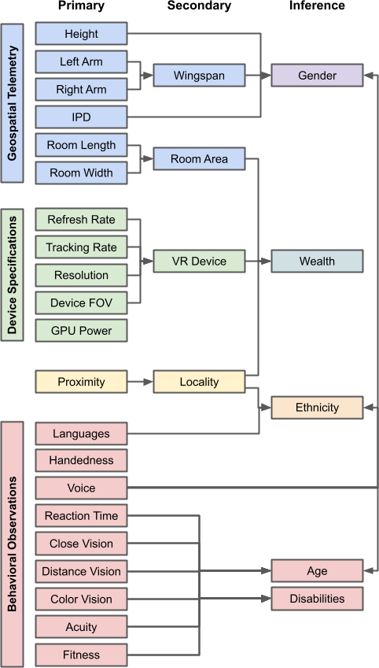

# MetaData
MetaData: Exploring unprecedented avenues for data harvesting in emerging AR/VR environments

[Game](https://github.com/VCNinc/MetaData/releases) |
[Scripts](https://github.com/VCNinc/MetaData/tree/main/Scripts) |
[Sample Data](https://github.com/VCNinc/MetaData/tree/main/Data) |
[Sample Results](https://github.com/VCNinc/MetaData/tree/main/Figures) |
[Author](https://github.com/VCNinc) |
[Co-Author](https://github.com/gonzalo-munillag)

This repository contains a virtual reality "escape room" game written in C# using the Unity game engine. It is the chief data collection tool for a research study called "MetaData," which aims to shed light on the unique privacy risks of virtual telepresence ("metaverse") applications. While the game appears innocuous, it attempts to covertly harvest 25+ private data attributes about its player from a variety of sources within just a few minutes of gameplay.

__Contents__
- [Getting Started](#getting-started)
- [Game Overview](#game-overview)
- [Data Collection Tools](#data-collection-tools)
- [Data Analysis Scripts](#data-analysis-scripts)
- [Sample Data & Results](#sample-data--results)

## Getting Started
### Building/Installation
The entire repository (outermost folder) is a Unity project folder built for editor version 2021.3.1f1. It can be opened in Unity and built for a target platform of your choice. We have also provided a [pre-built executable](https://github.com/VCNinc/MetaData/releases) for SteamVR on Windows (64-bit), which has been verified to work on the HTC Vive, HTC Vive Pro 2, and Oculus Quest 2 using Oculus Link. If you decide to build the project yourself, make sure you add a "Data" folder to the output directory where the game can store collected telemetry.

### Running & Data Collection
Run "Metadata.exe" to launch the game. Approximately once every second, the game will output a .txt file containing the relevant observations from the last second of gameplay. At the end of the experiment, these files can be concatenated into a single data file to be used for later analysis: `cat *.txt > data.txt`.

### Controls
The following keyboard controls are available (intended for use by the researcher conducting the experiment):

`space`: teleport to next room 
`b`: teleport to previous room 
`r`: reset all rooms 
`p`: pop balloon (room #6) 
`u`: reveal letter (room #8) 
`m`: reveal letter (room #9) 
`c`: play sentence 1 (room #20) 
`v`: play sentence 2 (room #20) 

Many of these controls will make more sense in the context of the game overview. The data logging template included below under [data collection tools](#data-collection-tools) also includes these controls in the relevant locations.

## Game Overview
 
The above figure shows an overview of the escape room building and several of the rooms contained within it. Players move from room to room within the building, completing one or more puzzles to find a "password" before moving to the next room. Further details about each of the rooms are included below.

## Data Collection Tools

## Data Analysis Scripts

## Sample Data & Results

## Data Sources
 

### Geospatial Telemetry
#### Biometric Measurements
 
Identifying height and wingspan from tracking telemetry

#### Environmental Measurements
 
Identifying room dimensions from tracking telemetry

### Device Specifications
 
Identifying device refresh rate from tracking data

### Location
 
Identifying user location from server proximity

### Behavioral Observations
#### Languages
 
Identifying languages spoken by tracking visual attention

#### Handedness
 
Identifying handedness by observing user interactions

#### Reaction Time
 
Identifying reaction time by observing user interactions

#### Vision
 
Identifying visual acuity by tracking user perception

#### Acuity
 
Assessing memory by measuring user performance
